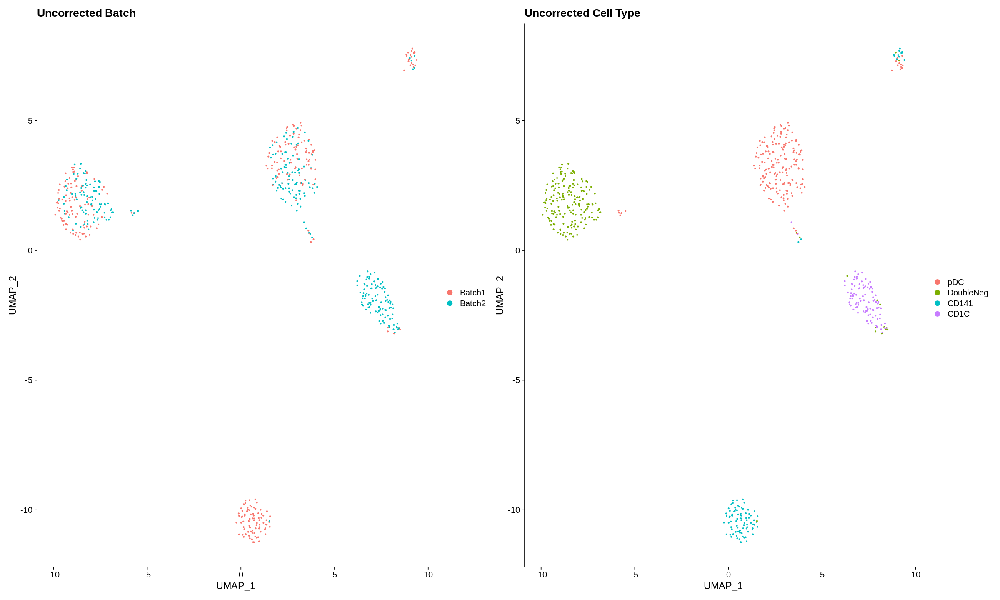
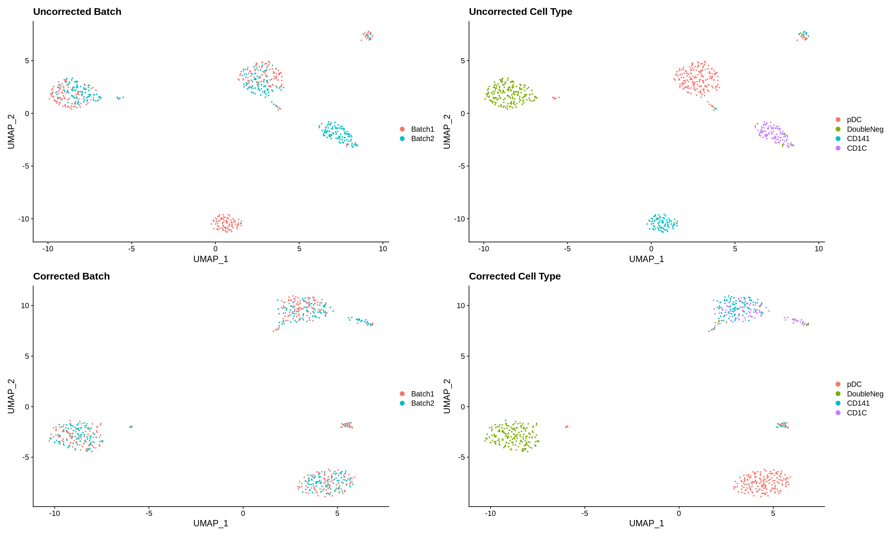

# Merge example vignettes

For more information on specific function parameters and class structures, see sections \@ref(functions) and \@ref(classes) respectively. This chapter covers basic vignettes of different integration methods using the example dataset provided in our package under `dendrites` from [Villani et al. 2017]('https://science.sciencemag.org/content/356/6335/eaah4573.abstract?casa_token=Il6aAbDukAcAAAAA:g6j1TW5RkK2J488DrHHgSmrCRwYTOgFHoH_X6H_bDL7PeuX5h3Ak2zMPEPAi4KKr_WaFZ2ekMc6uwg8').

## Processing data without merging batches

The following work flow is for processing data without performing batch correction. This can be done to prepare your data for downstream visualization without having to manually perform normalizing and scaling.

```{r eval=FALSE}
library(ensemblemerge)

params = setParams(method = "Uncorrected", batch = "batchlb") #any additional processing argument can be added here, see chapter 3: classes

uncorrected = Merge(params, dendrites)
```

`uncorrected` contains normalized and scaled read counts and a PCA reduction. generating a UMAP reduction can be done by the following.

```{r eval=FALSE}
library(Seurat)
uncorrected = as.Seurat(uncorrected, counts = "counts", data = "logcounts")
uncorrected <- RunUMAP(uncorrected, reduction = "PCA", dims = 1:20, seed.use = 1)
uncorrected <- FindNeighbors(uncorrected, reduction = 'umap', dims = 1:2, verbose = FALSE)
uncorrected <- FindClusters(uncorrected, algorithm = 3, resolution = 0.01, verbose = FALSE)
uncorrected$cluster <- Idents(uncorrected)
```

Visualize the UMAP.

```{r eval=FALSE}
Idents(uncorrected) = "batchlb"
p1 <- DimPlot(uncorrected, reduction = "umap", pt.size = 0.5, shuffle = TRUE) + ggplot2::ggtitle(label = "Uncorrected Batch")
Idents(uncorrected) = "CellType"
p2 <- DimPlot(uncorrected, reduction = "umap", pt.size = 0.5, shuffle = TRUE) + ggplot2::ggtitle(label = "Uncorrected Cell Type")
p1 + p2
```
```{r echo=FALSE, fig.cap='Uncorrected UMAP of single cell data by batch and cell type', out.height='80%', fig.align='center', fig.asp=.75}

```

## Merging with Seurat

This workflow is for integrating batches with the [Seurat V3]('https://satijalab.org/seurat/articles/integration_introduction.html') batch correction method.

```{r eval=FALSE}
library(ensemblemerge)

params = setParams(method = "Seurat", batch = "batchlb") #any additional processing argument can be added here, see chapter 3: classes

seurat_integrate = Merge(params, dendrites)
```

`seurat_integrate` contains normalized and scaled read counts and a PCA reduction. generating a UMAP reduction can be done by the following.

```{r eval=FALSE}
library(Seurat)
seurat_integrate = as.Seurat(seurat_integrate, counts = "logcounts", data = "logcounts")
seurat_integrate <- RunUMAP(seurat_integrate, reduction = "PCA", dims = 1:20, seed.use = 1)
seurat_integrate <- FindNeighbors(seurat_integrate, reduction = 'umap', dims = 1:2, verbose = FALSE)
seurat_integrate <- FindClusters(seurat_integrate, algorithm = 3, resolution = 0.01, verbose = FALSE)
seurat_integrate$cluster <- Idents(seurat_integrate)
```

Visualize the UMAP (*including the uncorrected data for reference*).

```{r eval=FALSE}
Idents(uncorrected) = "batchlb"
p1 <- DimPlot(uncorrected, reduction = "umap", pt.size = 0.5, shuffle = TRUE) + ggplot2::ggtitle(label = "Uncorrected Batch")
Idents(uncorrected) = "CellType"
p2 <- DimPlot(uncorrected, reduction = "umap", pt.size = 0.5, shuffle = TRUE) + ggplot2::ggtitle(label = "Uncorrected Cell Type")
Idents(seurat_integrate) = "batchlb"
p3 <- DimPlot(seurat_integrate, reduction = "umap", pt.size = 0.5, shuffle = TRUE) + ggplot2::ggtitle(label = "Corrected Batch")
Idents(seurat_integrate) = "CellType"
p4 <- DimPlot(seurat_integrate, reduction = "umap", pt.size = 0.5, shuffle = TRUE) + ggplot2::ggtitle(label = "Corrected Cell Type")
p1 + p2 + p3 + p4
```
```{r echo=FALSE, fig.cap='Seurat V3 corrected UMAP of single cell data by batch and cell type', out.height='80%', fig.align='center', fig.asp=.75}

```